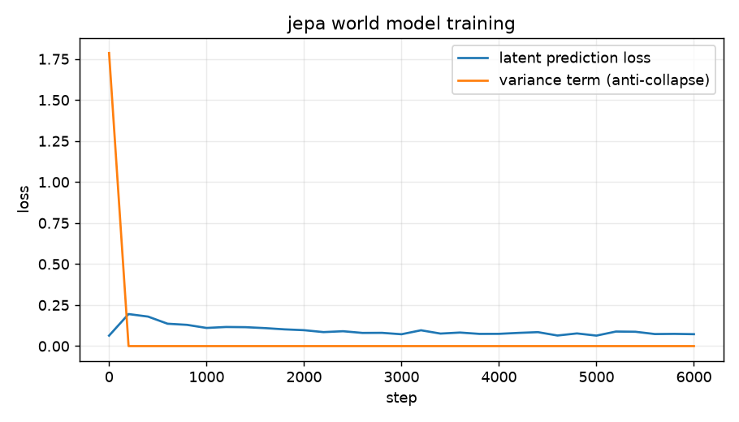
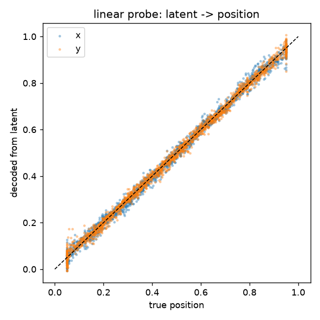
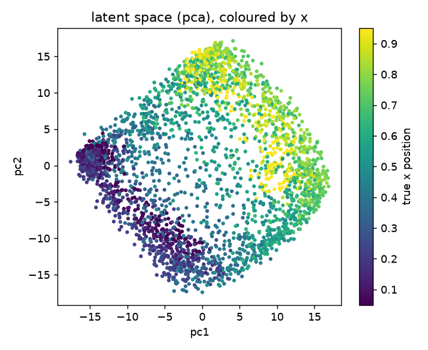
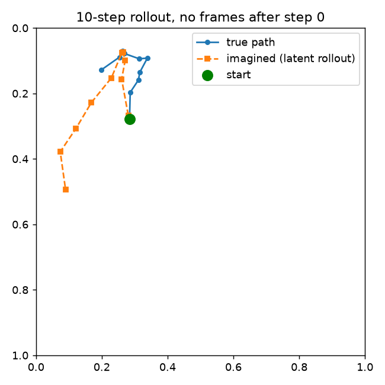
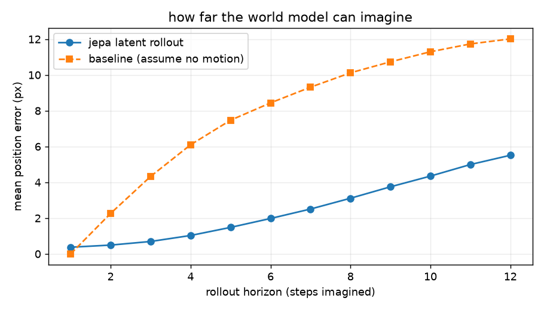

# jepa-world-model

a small world model built around a **jepa** (joint embedding predictive
architecture) objective, written from scratch in pytorch. i built it for a school
project to actually understand the idea behind lecun's jepa: instead of
predicting the future in pixels, you predict it in **representation space**.

the toy world is a ball bouncing in a 2d box, pushed around by actions. the model
only ever sees small grayscale frames, never the true coordinates, and it learns
to predict where the world goes next, in latent space.

```
jepa-world-model/
├── env.py      # the bouncing-ball world (renders frames, gives transitions)
├── model.py    # encoder + predictor + ema target encoder + the jepa loss
├── train.py    # training loop
└── viz.py      # probe + rollout + all the plots
```

## the idea

a normal "predict the next frame" model wastes most of its effort reconstructing
pixels that don't matter (the exact shape of the blob). jepa skips that. the loss
is computed entirely between latent vectors:

- an **encoder** turns a frame into a latent vector
- a **predictor** takes `(latent_t, action)` and predicts `latent_{t+1}`
- a **target encoder** (a slow ema copy of the encoder) encodes the real next
  frame - that's the thing the predictor has to match

```
        frame_t ──encoder──► z_t ─┐
                                  ├─predictor─► ẑ_{t+1}  ≈  z_{t+1}
        action  ──────────────────┘                         ▲
        frame_{t+1} ──target-encoder (ema, stop-grad)────────┘
```

the obvious trap is **collapse**: if the encoder sends every frame to the same
vector, the loss is zero and the model learned nothing. two standard tricks stop
that: the ema + stop-gradient asymmetry on the target (byol / i-jepa), and a
small variance regulariser (vicreg style) that keeps each latent dimension alive.

one gotcha worth calling out: a single still frame shows *where* the ball is but
not *which way it's moving* - velocity is invisible in one image. so the encoder
actually gets **two stacked frames** (previous + current), the same frame-stacking
trick used in atari rl. without it the predictor can't roll the world forward at
all (i tried - the rollout just drifts off immediately).



the prediction loss drops while the variance term stays near zero - the
representation is learning real structure without collapsing.

## does the latent actually mean anything?

to check, i freeze the encoder and fit a single **linear** layer from the latent
to the ball's true `(x, y)`. if the latent encodes position, a linear map is
enough - and it is: **R² = 0.996**, mean error **0.55 px** on a 28 px image.



and the latent space, projected to 2d with pca and coloured by the ball's x
position, comes out smoothly organised by where the ball is - not collapsed:



## the payoff: imagining the future in latent space

this is the world-model part. i encode **only the first pair of frames**, then
run just the predictor forward using the action sequence - no more real frames -
and decode each imagined latent back to a position with the probe. the imagined
trajectory tracks the real one for several steps before the usual open-loop
drift kicks in (bounces are the hard part):



averaged over 300 episodes, the imagined rollout stays far below a "the ball
never moves" baseline at every horizon - **0.37 px error after 1 step, 5.5 px
after 12** - and degrades gracefully instead of blowing up:



## notes

it's a toy on purpose - one ball, simple dynamics - so the whole thing trains in
minutes and you can actually see what the latent learned. the same recipe (encode,
predict in latent, ema target, no pixel reconstruction) is what scales up to
i-jepa on images and to world models for planning.
